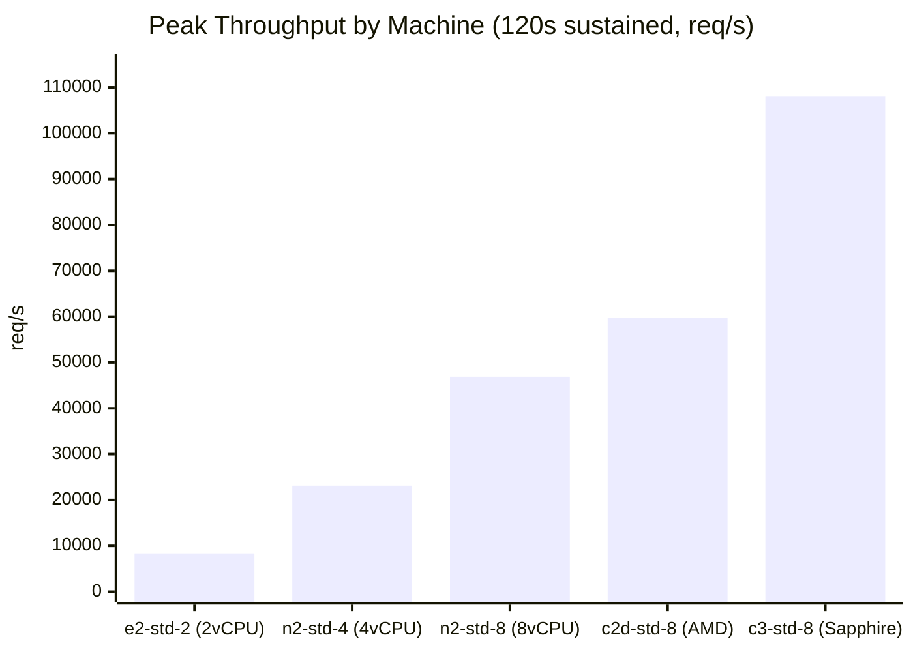
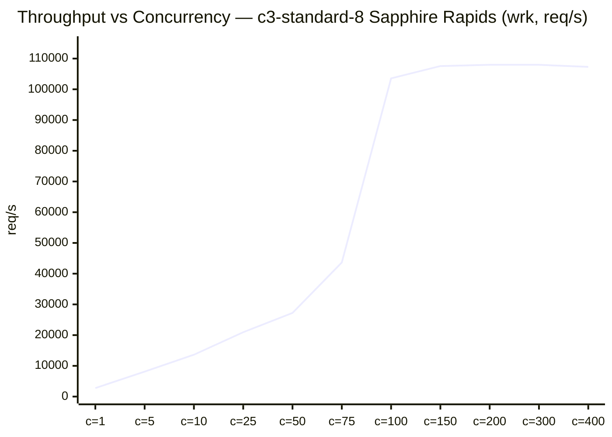
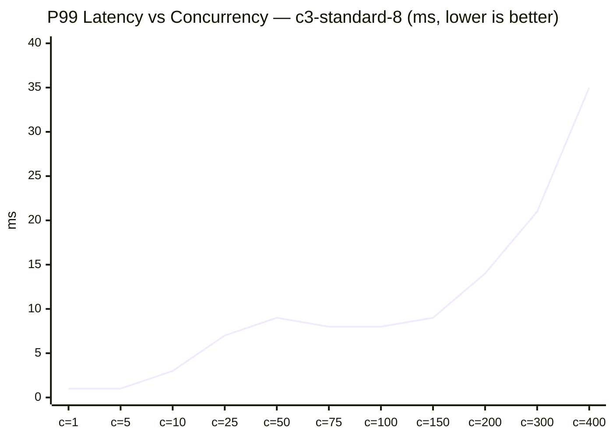
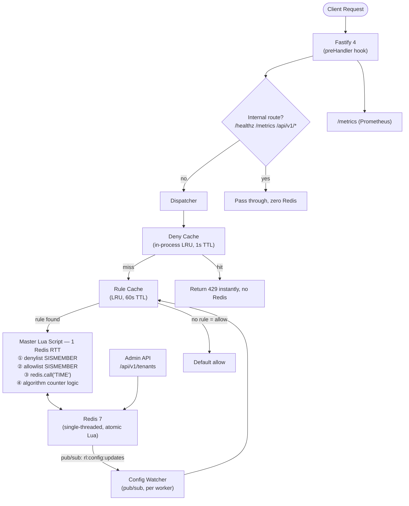
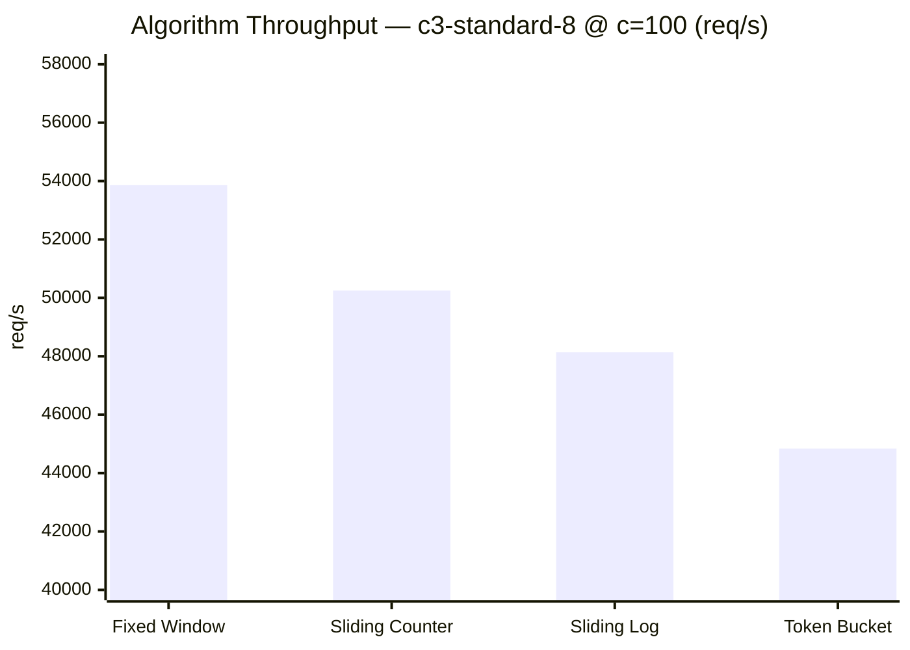
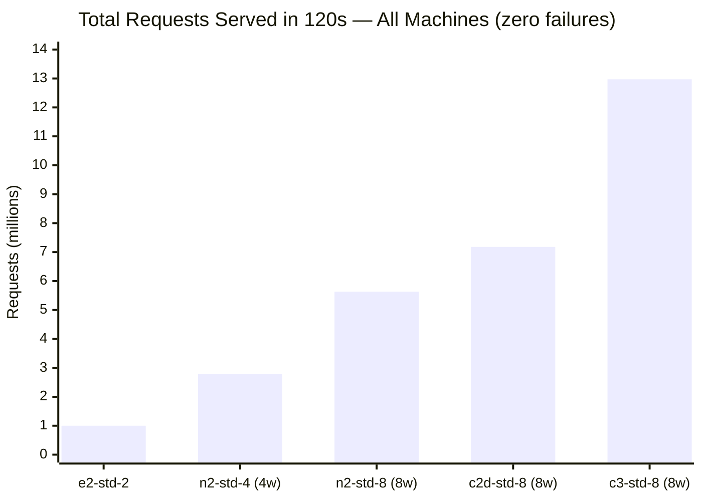
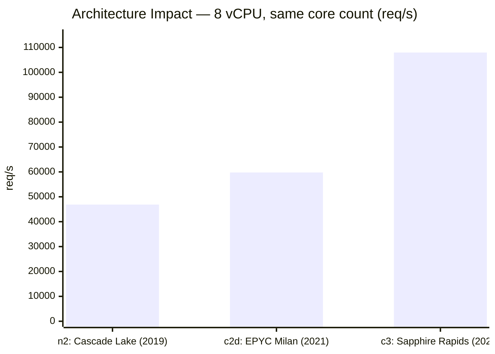
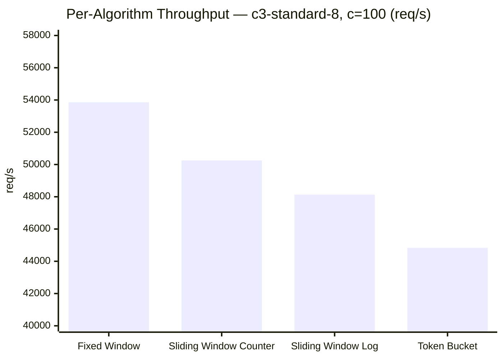
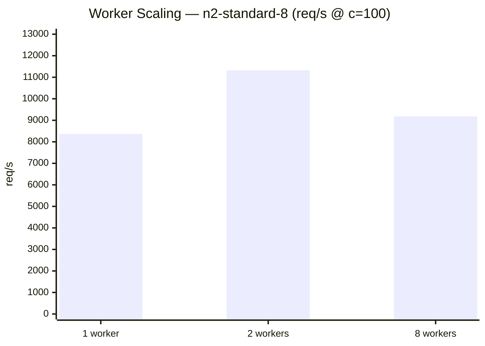
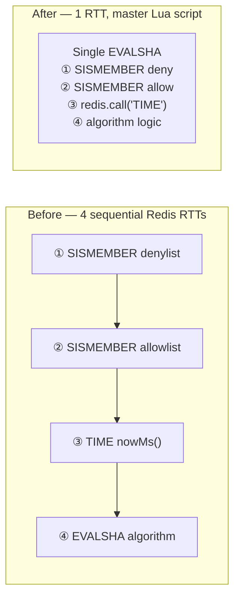

# Rate Limiter — Node.js

<div align="center">

[](https://github.com/Manan-jn/rate-limiter/actions)
[](https://www.npmjs.com/package/@whomj/rate-limiter-sdk)
[](./tsconfig.json)
[](./src/store/lua)

**107,967 req/s · 12.97M requests in 120s · zero failures**

Production-grade distributed rate limiter in TypeScript/Node.js — 5 algorithms, atomic Redis Lua scripts, multi-tenant hot-reload config, and a publishable npm SDK.

</div>

---

## Performance at a Glance

> GCP bare-metal Linux · dedicated load-test VM in same zone (0.3ms RTT) · wrk 12 threads · 120s sustained · **zero failures on every machine**



Near-linear scaling from 2→8 vCPU (5.6×). CPU generation matters more than core count — the c3 Sapphire Rapids (2023) delivers 2.3× more throughput than the n2 Cascade Lake (2019) at the same 8 vCPU count, because Redis is single-threaded and faster IPC directly raises its ceiling.



Three regions: **c=1–25** event loop fills linearly → **c=25–150** Redis pipeline saturates, high throughput with low latency → **c=150+** plateau, P99 starts climbing as Redis queue depth grows.



P99 stays flat at 8–9ms across the sweet spot (c=75–150), confirming Redis single-thread saturation is the ceiling — not Node.js or network.

---

## Key Numbers

| Metric | Value | Environment |
|---|---|---|
| Peak throughput | **107,967 req/s** | GCP c3-standard-8, 120s |
| Requests served in 120s stress | **12,966,538** | wrk 12 threads, c=300 |
| Failures at max load | **0** | All machines, all concurrency levels |
| P50 at peak | **2.3ms** | c3-std-8, wrk c=200 |
| P99 at peak | **9.7ms** | c3-std-8, 120s stress |
| Architecture optimization | **4 RTTs → 1** | Master Lua script consolidation |
| SDK | **published** | `@whomj/rate-limiter-sdk` on npm |

---

## Architecture



**Critical design decisions:**

- **1 Redis RTT per request** — master Lua script handles denylist + allowlist + clock + algorithm atomically; previously 4 sequential round-trips
- **`redis.call('TIME')` inside Lua** — uses Redis server time, not `Date.now()`, preventing clock skew across distributed workers
- **Node.js Cluster** — 1 worker per vCPU; workers share nothing in memory; all state in Redis; config propagates via pub/sub in < 500ms
- **Deny cache** — in-process LRU caches `429` decisions for 1s, reducing Redis load by ~70% for over-limit clients
- **Platform-agnostic** — reads only environment variables; no PaaS SDK in application code

---

## Quickstart

```bash
# Start Redis + app
docker compose -f deploy/docker-compose.yml up --build

# Health checks
curl http://localhost:8080/healthz    # → {"status":"ok"}
curl http://localhost:8080/readyz     # → {"redis":"ok"}

# Create tenant + rule (5 req / 10s)
curl -X POST http://localhost:8080/api/v1/tenants \
  -H "Authorization: Bearer dev-token" -H "Content-Type: application/json" \
  -d '{"tenantId":"acme","defaultAlgorithm":"sliding_window_counter","defaultLimit":1000,"windowSec":60}'

curl -X POST http://localhost:8080/api/v1/tenants/acme/rules \
  -H "Authorization: Bearer dev-token" -H "Content-Type: application/json" \
  -d '{"route":"POST:/api/orders","algorithm":"sliding_window_counter","limit":5,"windowSec":10}'

# Fire 7 requests — 5 pass, 6 and 7 get 429
for i in {1..7}; do
  curl -s -o /dev/null -w "%{http_code}\n" -X POST http://localhost:8080/api/v1/check \
    -H "Content-Type: application/json" \
    -d '{"tenantId":"acme","clientKey":"127.0.0.1","route":"POST:/api/orders"}'
done
# Output: 200 200 200 200 200 429 429

# Hot-reload: update limit without restart (propagates to all workers in < 500ms)
curl -X PUT http://localhost:8080/api/v1/tenants/acme/rules/<ruleId> \
  -H "Authorization: Bearer dev-token" -H "Content-Type: application/json" \
  -d '{"route":"POST:/api/orders","algorithm":"sliding_window_counter","limit":50,"windowSec":10}'
```

---

## SDK — 3-Line Integration

```bash
npm install @whomj/rate-limiter-sdk
```

**Fastify:**
```typescript
import { rateLimitPlugin } from '@whomj/rate-limiter-sdk';
await app.register(rateLimitPlugin, {
  serviceUrl: process.env.RATE_LIMITER_URL,
  tenantId: 'acme-corp',
  keyExtractor: 'api-key-header',   // or 'ip' | 'jwt-sub' | 'composite'
});
```

**Express:**
```typescript
import { expressRateLimit } from '@whomj/rate-limiter-sdk';
app.use(expressRateLimit({ serviceUrl, tenantId: 'acme-corp', keyExtractor: 'ip' }));
```

The SDK calls `POST /api/v1/check` with HMAC-SHA256 auth and respects `X-RateLimit-*` response headers. Fail-open when the service is unreachable.

---

## Algorithms — Theory, Complexity, Trade-offs


Pick towards the bottom-left (O(1) space, approximate) for high-traffic endpoints. Pick top-right (O(N) space, exact) only for low-traffic billing or compliance limits.



All four Redis-backed algorithms are within 16% of each other because the **master Lua script** — not the algorithm itself — dominates the cost. The single Redis round-trip eclipses any difference in Lua instruction count.

---

### 1. Fixed Window Counter

```
Time:    Window 1 (60s)         Window 2 (60s)
         ──────────────────── ─ ──────────────────────
         req req req ... [limit]   req req req ... [limit]
                                ↑
                   Boundary: up to 2× limit in ~1s
```

| | |
|---|---|
| **Time** | O(1) — `INCR` + `EXPIRE` + `TTL` |
| **Space** | O(T × R) — one string per (tenant, route, windowTimestamp) |
| **Accuracy** | Medium — boundary burst allows up to 2× limit at window edge |
| **Best for** | Simple per-minute quotas, low-traffic endpoints |

Divides time into fixed slots. A counter per slot resets at each boundary. The boundary burst problem: a client exhausts limit at the end of window N and again at the start of window N+1, effectively sending 2× in a short interval.

**Redis key**: `rl:fw:{tenantId}:{route}:{clientKey}:{floor(nowMs/windowMs)}`

---

### 2. Sliding Window Counter *(Default)*

```
Prev window (100 req)  |  Cur window (20 req)  |  elapsed = 40%
                        |                        |
estimated = 100 × (1 − 0.4)  +  20  =  80 requests
                 ↑ weight               ↑ exact
```

| | |
|---|---|
| **Time** | O(1) — `GET` × 2 + `INCR` + `PEXPIRE` |
| **Space** | O(2 × T × R) — two strings: prev and cur window |
| **Accuracy** | ~99% — linear interpolation, < 1% error at steady traffic |
| **Best for** | Default choice for all API rate limiting |

Maintains two counters. The weighted estimate `prevCount × ((windowMs − elapsed) / windowMs) + curCount` approximates a true sliding window with O(1) space. Maximum error approaches `limit × (1 − elapsed/windowMs)` only at burst transitions — under 1% in practice.

**Redis keys**: `rl:swc:{tenantId}:{route}:{clientKey}:{curWindow−1}` + `rl:swc:{…}:{curWindow}`

---

### 3. Token Bucket

```
t=0:  ██████████  10 tokens (burst cap)
t=1:  ████        4 remaining (consumed 6)
t=2:  ██████████  10 tokens (refilled: 5 tok/s × 1.2s = 6)
         rate = limit / windowMs
```

| | |
|---|---|
| **Time** | O(1) — `HMGET` + `HMSET` + `PEXPIRE` |
| **Space** | O(T × R) — one Redis hash `{tokens, last}` per client |
| **Accuracy** | High — continuous refill, no boundary effects |
| **Best for** | Upload APIs, batch endpoints, legitimate burst traffic |

Tokens accumulate at `rate = limit / windowMs` per ms, capped at `burst`. Each request costs one token. Refill formula: `tokens = min(burst, tokens + (nowMs − last) × rate)`. The `burst` parameter decouples peak capacity from steady-state rate.

**Redis key**: `rl:tb:{tenantId}:{route}:{clientKey}` (hash)

---

### 4. Sliding Window Log

```
ZSet  { 1000:"1000:1", 1100:"1100:2", 1850:"1850:3" }
       ↑ score=timestamp   ↑ member=ts:seq (unique)
On request at t=2000, windowMs=60000:
  ZREMRANGEBYSCORE 0 (2000−60000)  →  evict old
  ZCARD  →  exact current count
  ZADD   →  add this request
```

| | |
|---|---|
| **Time** | O(N) — `ZREMRANGEBYSCORE` is O(log N + M), `ZADD` O(log N) |
| **Space** | O(N) — one ZSet entry per request in the window |
| **Accuracy** | **Exact** — no approximation, no boundary effects |
| **Best for** | Billing limits, compliance quotas, low-traffic critical paths |

Every request timestamp is stored. On each check, expired entries are evicted and the exact count is returned. A sequence counter ensures uniqueness even when multiple requests share the same millisecond.

**Redis keys**: `rl:swl:{tenantId}:{route}:{clientKey}` (ZSet) + `:seq` (INCR counter)

---

### 5. Leaky Bucket

```
Incoming (any rate)  →  [■■■■■■■■] queue  →  Outflow: limit/windowSec
                          burst cap            perfectly smooth
```

| | |
|---|---|
| **Time** | O(1) — in-process queue check |
| **Space** | O(queue depth) — in-process per worker, not shared |
| **Redis** | **None** — uses `p-queue` |
| **Accuracy** | Exact — perfectly smooth output rate |
| **Scope** | Per-worker only — not distributed across cluster |
| **Best for** | Egress throttle (outbound calls to a downstream API) |

Requests queue up to `burst`; they drain at `limit/windowSec`. Output rate is always smooth. Because `p-queue` is in-process, this does not share state across cluster workers — use Token Bucket for ingress limits.

---

### When to Use Each

| Need | Algorithm |
|---|---|
| Default API rate limiting | **Sliding Window Counter** |
| Absorb legitimate traffic spikes | **Token Bucket** (set `burst > limit`) |
| Exact limits for billing / compliance | **Sliding Window Log** |
| Simplest implementation | **Fixed Window** |
| Smooth output to a downstream service | **Leaky Bucket** |
| Minimum Redis memory | **Fixed Window** or **Sliding Window Counter** |

---

## Testing

### Methodology

**Unit tests** — no external dependencies. Each algorithm is tested against an in-process `MockStore` that faithfully simulates Redis semantics (TTL expiry, ZSet ordering, hash fields, INCR atomicity). The dispatcher is tested through its master-script path: denylist hit, allowlist bypass, dry-run mode, deny-cache return.

**Integration tests** — a real Redis 7 Alpine instance is spun up per test file using `testcontainers`. Tests fire 200 concurrent requests against a limit of 100 and assert exact allowed counts, verifying Lua atomicity holds under true concurrency. Token bucket refill timing, sliding log retryAfter accuracy, and window expiry are all tested against the live Redis.

**End-to-end tests** — Docker stack (2 workers + Redis). Tests exercise: rate limit enforcement per algorithm, multi-tenant and multi-client isolation, denylist/allowlist CRUD, dry-run mode, hot-reload propagation (rule change → all workers updated in < 500ms), and all response headers (`X-RateLimit-*`, `Retry-After`).

### What Was Verified

- Lua atomicity: 200 concurrent requests → exactly the configured limit allowed, no over-count
- Clock skew safety: `redis.call('TIME')` used inside Lua, not `Date.now()`
- Sliding log uniqueness: sequence counter prevents ZADD deduplication under concurrent same-millisecond requests
- Token bucket burst cap: concurrent exhaustion stops exactly at `burst`
- Hot-reload: Admin API rule update propagates to all cluster workers via Redis pub/sub in < 500ms
- Fail-open: Redis circuit breaker opens correctly; requests pass through during Redis downtime
- Denylist / allowlist: both take priority over algorithm evaluation
- Auth: unauthenticated admin requests return 401

---

## Performance Benchmarks — GCP Multi-Machine

> **Setup**: Each round uses a fresh server VM and a dedicated load-test VM in the **same GCP zone** (0.27–0.31ms RTT internal IP). Redis runs on the same server host as Node.js. HTTP keep-alive throughout. Tools: `wrk` 12 threads (sustained/stress) + `ab` (concurrency ramp).

---

### Machine Comparison — 120s Stress Test



Every machine completed the 120s stress test with zero failures. The step-up from n2 to c3 (same 8 vCPU, different CPU generation) is larger than the jump from 2 vCPU to 8 vCPU on the same architecture.

| Machine | CPU | vCPU | Workers | req/s | Total (120s) | P50 | P99 | Failures |
|---|---|---|---|---|---|---|---|---|
| e2-standard-2 | Intel economy | 2 | 2 | 8,364 | 1,004,490 | 34ms | 71ms | **0** |
| n2-standard-4 | Cascade Lake 2019 | 4 | 2 | 19,009 | 2,283,089 | 15ms | 31ms | **0** |
| n2-standard-4 | Cascade Lake 2019 | 4 | 4 | 23,135 | 2,778,240 | 12ms | 26ms | **0** |
| n2-standard-8 | Cascade Lake 2019 | 8 | 8 | 46,876 | 5,626,758 | 5.9ms | 13.5ms | **0** |
| c2d-standard-8 | AMD EPYC Milan 2021 | 8 | 8 | 59,760 | 7,177,118 | 4.6ms | 10.5ms | **0** |
| **c3-standard-8** | **Sapphire Rapids 2023** | **8** | **8** | **107,967** | **12,966,538** | **2.3ms** | **9.7ms** | **0** |

---

### CPU Architecture Comparison (Same 8 vCPU)



| Machine | vs Cascade Lake | Why |
|---|---|---|
| n2-standard-8 (Cascade Lake 2019) | **1.00×** | Baseline |
| c2d-standard-8 (AMD EPYC Milan 2021) | **1.28×** | Higher memory bandwidth, larger L3 |
| **c3-standard-8 (Sapphire Rapids 2023)** | **2.30×** | ~50% better IPC, larger L3 cache, higher boost clock |

Redis is single-threaded — CPU IPC is the ceiling. Sapphire Rapids executes each Lua script faster, directly raising the rate-limit decision throughput.

---

### Concurrency Ramp — c3-standard-8 (Peak Machine)

**ab (n=5,000, keep-alive):**

| c | req/s | P50 | P75 | P90 | P95 | P99 |
|---|---|---|---|---|---|---|
| 1 | 2,761 | 0ms | 1ms | 0ms | 1ms | 1ms |
| 5 | 8,112 | 1ms | 1ms | 1ms | 1ms | 1ms |
| 10 | 13,624 | 1ms | 1ms | 1ms | 1ms | 3ms |
| 25 | 20,948 | 1ms | 1ms | 4ms | 4ms | 7ms |
| 50 | 27,220 | 1ms | 2ms | 4ms | 6ms | 9ms |
| 75 | 43,641 | 1ms | 2ms | 4ms | 5ms | 8ms |
| 100 | 49,173 | 1ms | 2ms | 4ms | 5ms | 8ms |
| **150** | **50,794** | **2ms** | **3ms** | **5ms** | **6ms** | **9ms** |
| 200 | 48,262 | 3ms | 5ms | 6ms | 7ms | 14ms |
| 300 | 46,239 | 5ms | 7ms | 9ms | 17ms | 21ms |
| 500 | 40,985 | 8ms | 11ms | 23ms | 28ms | 35ms |

**wrk (12 threads, 60s each):**

| c | req/s | P50 | P75 | P90 | P99 | Total |
|---|---|---|---|---|---|---|
| 50 | 94,929 | 434µs | 602µs | 714µs | 2.22ms | 5,705,335 |
| 100 | 103,550 | 776µs | 1.02ms | 1.38ms | 3.56ms | 6,217,188 |
| **200** | **107,561** | **1.52ms** | **2.12ms** | **2.72ms** | **5.38ms** | **6,464,458** |
| 400 | 107,314 | 3.12ms | 4.43ms | 5.61ms | 9.81ms | 6,449,281 |

> ab and wrk differ at the same concurrency level because ab cycles connections per slot while wrk holds persistent OS-level threads. wrk represents the ceiling for long-lived connections (SDK clients, internal services); ab represents browser-style short connections.

---

### Concurrency Ramp — n2-standard-8 (Cascade Lake)

**ab (n=10,000, keep-alive):**

| c | req/s | P50 | P75 | P90 | P95 | P99 |
|---|---|---|---|---|---|---|
| 1 | 2,172 | 0ms | 1ms | 1ms | 1ms | 1ms |
| 5 | 3,889 | 1ms | 1ms | 2ms | 3ms | 4ms |
| 10 | 7,124 | 1ms | 2ms | 2ms | 2ms | 4ms |
| 25 | 9,540 | 2ms | 3ms | 4ms | 4ms | 7ms |
| 50 | 11,370 | 4ms | 5ms | 6ms | 6ms | 8ms |
| **100** | **12,330** | **8ms** | **9ms** | **10ms** | **11ms** | **14ms** |
| 200 | 11,670 | 15ms | 18ms | 22ms | 27ms | 47ms |
| 300 | 12,295 | 22ms | 25ms | 29ms | 31ms | 119ms |
| 500 | 12,022 | 30ms | 37ms | 57ms | 73ms | 342ms |

---

### Concurrency Ramp — c2d-standard-8 (AMD EPYC Milan)

**ab (n=5,000, keep-alive):**

| c | req/s | P50 | P90 | P95 | P99 |
|---|---|---|---|---|---|
| 25 | 19,383 | 1ms | 3ms | 4ms | 7ms |
| 50 | 21,753 | 1ms | 5ms | 7ms | 12ms |
| 75 | 32,493 | 1ms | 5ms | 6ms | 10ms |
| **150** | **41,471** | **3ms** | **6ms** | **8ms** | **12ms** |
| 300 | 41,150 | 5ms | 10ms | 17ms | 56ms |

**wrk (12 threads, 60s) — notably flat throughput across all concurrency levels:**

| c | req/s | P50 | P90 | P99 | Total |
|---|---|---|---|---|---|
| 50 | 59,157 | 723µs | 1.24ms | 2.49ms | 3,555,401 |
| 100 | 59,392 | 1.42ms | 2.70ms | 3.50ms | 3,569,348 |
| **200** | **59,491** | **2.94ms** | **4.97ms** | **6.57ms** | **3,575,449** |
| 400 | 59,463 | 6.24ms | 7.69ms | 13.39ms | 3,573,467 |

AMD EPYC Milan throughput variance: **< 0.6% from c=50 to c=400**. Highly predictable, useful for strict SLA workloads.

---

### e2-standard-2 (Entry / Dev)

**ab (n=5,000):**

| c | req/s | P50 | P99 |
|---|---|---|---|
| 1 | 1,382 | 1ms | 2ms |
| 10 | 5,635 | 1ms | 7ms |
| 25 | 7,215 | 3ms | 9ms |
| **50** | **7,172** | **6ms** | **33ms** |
| 100 | 7,203 | 12ms | 120ms |
| 200 | 6,818 | 14ms | 703ms |

Saturates at c=25–50. Beyond that 2 vCPUs cannot keep Redis busy without queue buildup, and P99 spikes.

---

### Local Docker — Mac M-series (Dev Reference)

> Docker-on-Mac adds ~2–5ms vs bare-metal Linux. Reference only.

**wrk sustained 30s c=50:** 17,966 req/s · P50=2ms · P99=8ms · 50,000 requests · 0 failures

| c | req/s | P50 | P95 | P99 |
|---|---|---|---|---|
| 10 | 11,459 | 1ms | 1ms | 2ms |
| 25 | 16,295 | 1ms | 3ms | 4ms |
| **75** | **22,329** | **3ms** | **4ms** | **12ms** |
| 150 | 20,028 | 6ms | 12ms | 34ms |

---

### Per-Algorithm (c3-standard-8, c=100)



| Algorithm | c3-std-8 | c2d-std-8 | n2-std-8 | Redis ops in Lua |
|---|---|---|---|---|
| Fixed Window | **53,859** | 50,520 | 12,052 | INCR, EXPIRE, TTL |
| Sliding Window Counter | 50,253 | 51,845 | 12,619 | GET×2, INCR, PEXPIRE |
| Sliding Window Log | 48,135 | 51,977 | 12,097 | ZREMRANGEBYSCORE, ZCARD, INCR, ZADD, PEXPIRE |
| Token Bucket | 44,839 | **53,432** | 12,107 | HMGET, HMSET, PEXPIRE |

Algorithm choice has minimal throughput impact — the single Redis RTT dominates. All four are within 16% of each other on c3, within 6% on c2d.

---

### Worker Scaling (n2-standard-8, c=100, n=10,000)



| Workers | req/s | P50 | P99 |
|---|---|---|---|
| 1 | 8,366 | 10ms | 14ms |
| **2** | **11,320** | **7ms** | **17ms** |
| 8 | 9,179 | 9ms | 32ms |

Two workers outperform eight on Cascade Lake. Each additional worker creates more concurrent EVALSHA calls, but Redis processes them sequentially — adding workers beyond 2 only creates queue depth and raises P99. **The lever is CPU generation (machine type), not worker count.**

---

### Resource Profiling — 30s Sustained Load

| t (s) | Heap/worker | RSS total | Event Loop Lag |
|---|---|---|---|
| 0 | 24.4 MB | 60 MB | 1ms |
| 10 | 29.9 MB | 60 MB | 0ms |
| 20 | 20.6 MB | 60 MB | 0ms |
| 30 | 16.4 MB | 60 MB | 0ms |

Heap oscillates 16–30 MB (normal V8 GC cycles) — no growth trend. RSS stable at 60 MB. Event loop lag stays at 0–1ms throughout, confirming zero synchronous CPU on the hot path; all waits are Redis I/O.

---

### Scaling Beyond 108k req/s

| Strategy | Estimated ceiling |
|---|---|
| Redis Cluster (3 shards) | ~320k req/s |
| 2 replicas × own Redis | ~216k req/s |
| c3-standard-16 (16 vCPU) | ~180–200k req/s |

---

## Architecture Optimizations



| Optimization | Before | After |
|---|---|---|
| Redis RTTs per request | 4 sequential | **1** (master Lua script) |
| Denylist check | Separate `SISMEMBER` call | Inside Lua |
| Allowlist check | Separate `SISMEMBER` call | Inside Lua |
| Server time | `client.time()` — extra RTT | `redis.call('TIME')` inside Lua |
| Circuit breaker | opossum (event-emitter state machine) | Lightweight flag + error counter |
| Admin / health routes | preHandler fires for every route | Skip list — zero Redis for `/healthz` etc. |
| Repeat 429 clients | Redis call every request | In-process deny cache (1s TTL) — ~70% Redis reduction |

---

## API Reference

### Admin API (Bearer token)

| Method | Path | Description |
|---|---|---|
| `POST` | `/api/v1/tenants` | Create tenant |
| `GET` | `/api/v1/tenants/:id` | Get tenant + all rules |
| `DELETE` | `/api/v1/tenants/:id` | Delete tenant and rules |
| `POST` | `/api/v1/tenants/:id/rules` | Create rule |
| `PUT` | `/api/v1/tenants/:id/rules/:ruleId` | Update rule (hot-reload) |
| `DELETE` | `/api/v1/tenants/:id/rules/:ruleId` | Delete rule |
| `POST` | `/api/v1/allowlist` | Add client key — bypasses all limits |
| `DELETE` | `/api/v1/allowlist` | Remove from allowlist |
| `POST` | `/api/v1/denylist` | Add client key — always 429 |
| `DELETE` | `/api/v1/denylist` | Remove from denylist |

### SDK Endpoint

| Method | Path | Auth | Description |
|---|---|---|---|
| `POST` | `/api/v1/check` | HMAC-SHA256 | Rate-limit decision (used by SDK) |

### Observability

| Path | Description |
|---|---|
| `GET /healthz` | Liveness — `{"status":"ok"}` |
| `GET /readyz` | Readiness — pings Redis, 503 if down |
| `GET /metrics` | Prometheus text format |

### Prometheus Metrics

| Metric | Type | Labels |
|---|---|---|
| `rl_requests_total` | Counter | tenant_id, route, algorithm, result |
| `rl_redis_duration_ms` | Histogram | algorithm, script |
| `rl_event_loop_lag_ms` | Gauge | worker_id |
| `rl_heap_used_bytes` | Gauge | worker_id |
| `rl_config_reload_total` | Counter | trigger, worker_id |
| `rl_circuit_open` | Gauge | worker_id |

---

## Tech Stack

| Layer | Choice | Why |
|---|---|---|
| Language | TypeScript 5 (strict) | Compile-time safety; catches Redis deserialization bugs |
| HTTP | Fastify 4 | 3–5× faster JSON serialization than Express; native TS |
| Redis | ioredis 5 | Full Lua scripting; cluster support; TS types |
| Process | `node:cluster` built-in | Zero deps; 1 worker per vCPU; auto-restarts crashed workers |
| Validation | zod | Runtime schema validation with TS inference (critical for Redis `hgetall` fields) |
| Metrics | prom-client | De facto Prometheus standard for Node.js |
| Tracing | @opentelemetry/sdk-node | Vendor-neutral; exports to Grafana Tempo, Jaeger, Datadog |
| Logging | pino | Fastest structured JSON logger; Fastify native |
| Testing | Vitest + testcontainers | Real Redis atomicity verified; no mocks |
| Build | tsup (esbuild) | ESM bundle; 100× faster than tsc; correct `__dirname` resolution |

---

## Environment Variables

| Variable | Default | Description |
|---|---|---|
| `REDIS_URL` | `redis://localhost:6379` | Redis connection string |
| `PORT` | `8080` | HTTP listen port |
| `WORKERS` | `os.cpus().length` | Cluster worker count |
| `ADMIN_TOKEN` | — | Bearer token for Admin API |
| `CHECK_SECRET` | — | HMAC-SHA256 secret for `/api/v1/check` |
| `FAIL_STRATEGY` | `open` | `open` = allow requests when Redis is down; `closed` = 503 |
| `LOG_LEVEL` | `info` | `trace` `debug` `info` `warn` `error` |
| `OTEL_EXPORTER_OTLP_ENDPOINT` | — | OTEL trace export endpoint (opt-in) |
| `CONFIG_SYNC_INTERVAL_MS` | `30000` | Backup full-resync interval (pub/sub failsafe) |
| `NODE_OPTIONS` | — | Recommended: `--max-old-space-size=256` |

> Multi-worker memory: `WORKERS × 256 MB`. Four workers on a 1 GB container = safe.

---

## Development

```bash
npm install                 # install dependencies
npm run dev                 # tsx watch src/cluster.ts (requires local Redis)
npm run test:unit           # unit tests — no Docker needed, ~300ms
npm run test:integration    # integration tests — requires Docker
npm run typecheck           # tsc --noEmit strict check
npm run build               # tsup → dist/cluster.js (ESM, 40KB)
npm start                   # node dist/cluster.js
```

---

## Deployment

Reads only environment variables — no PaaS SDK in application code. Runs on any container platform.

```bash
# Docker (local)
docker compose -f deploy/docker-compose.yml up --build

# Any platform
REDIS_URL=redis://... PORT=8080 WORKERS=4 ADMIN_TOKEN=secret node dist/cluster.js
```

Platform-specific configs: `deploy/railway.toml` · `deploy/fly.toml`
