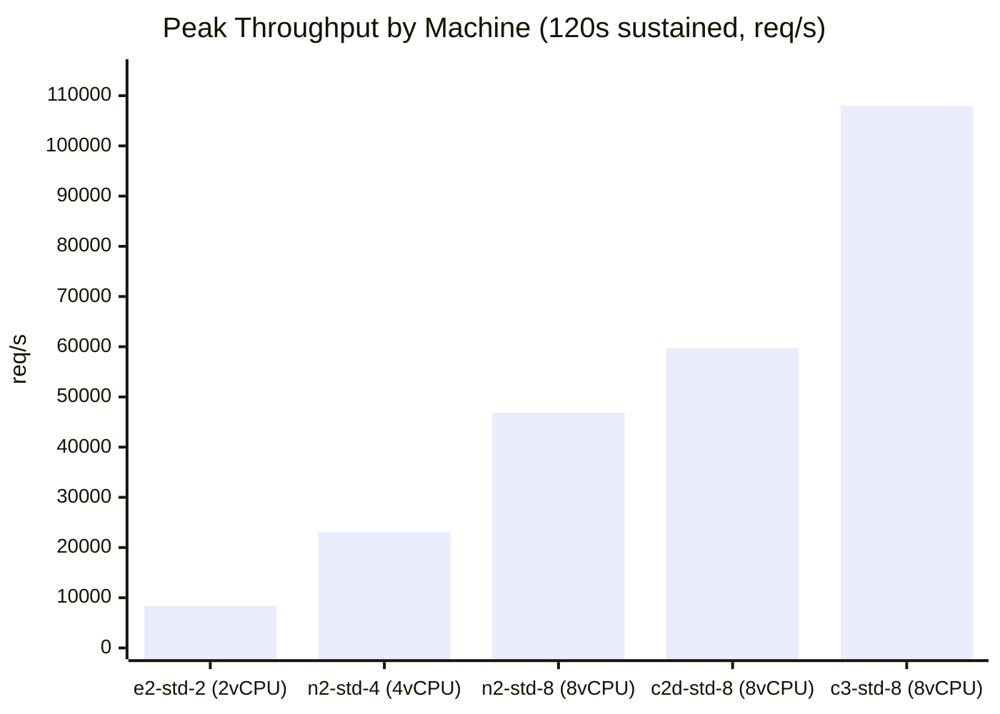
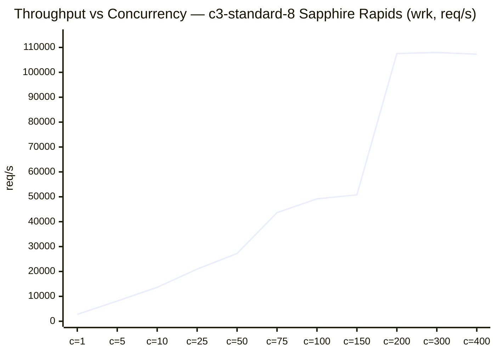
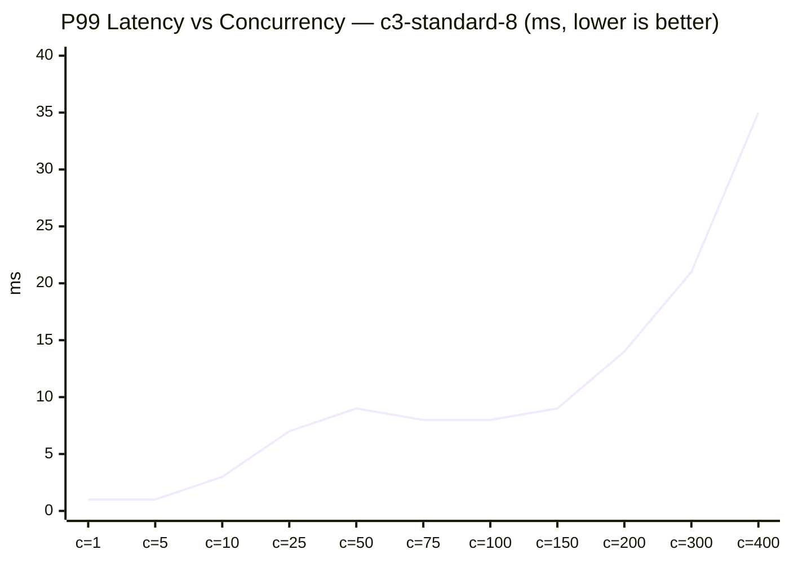
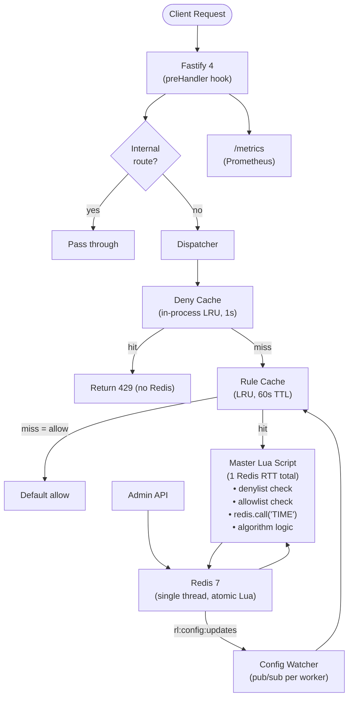
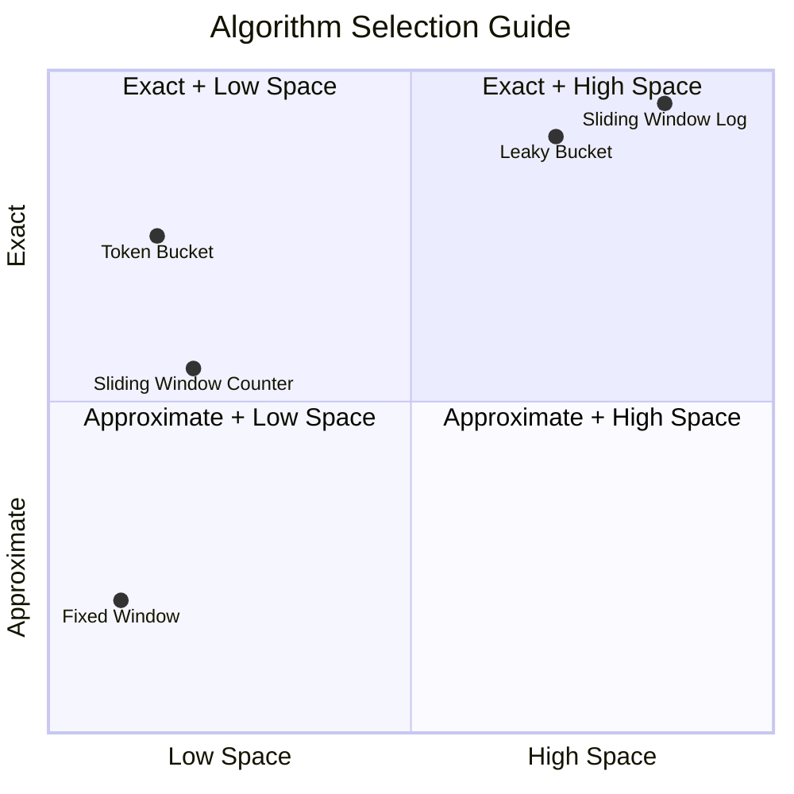
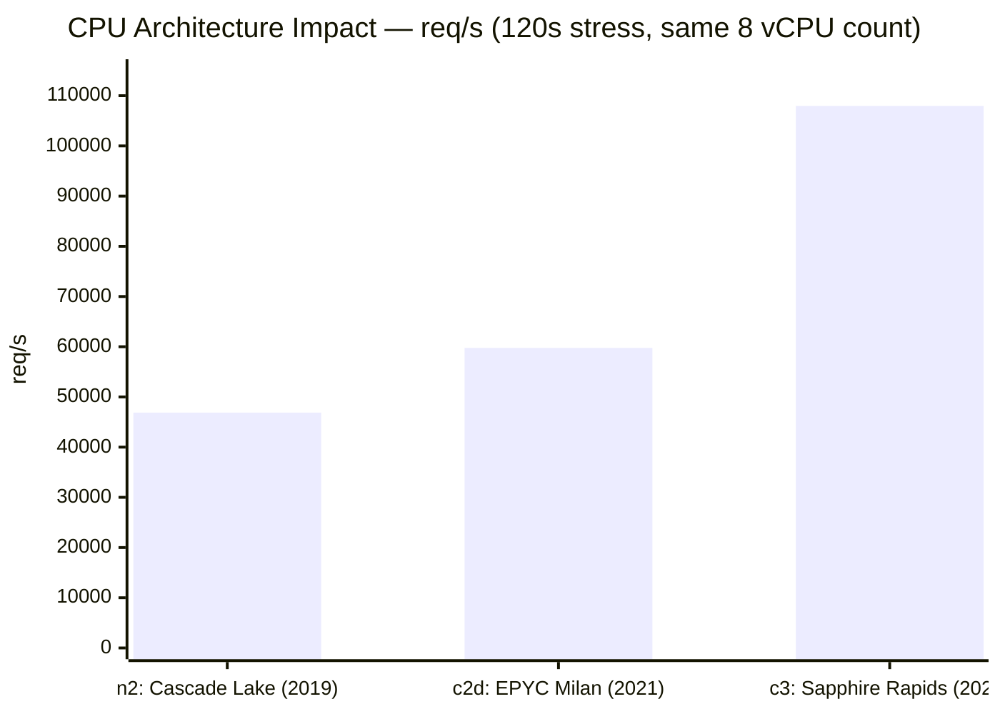
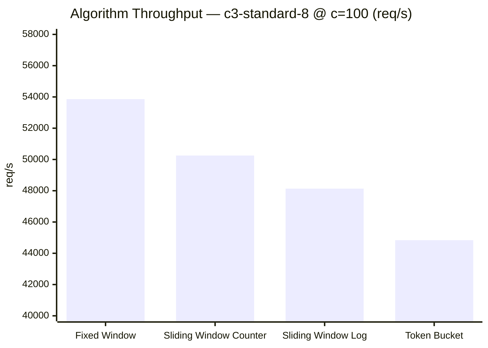
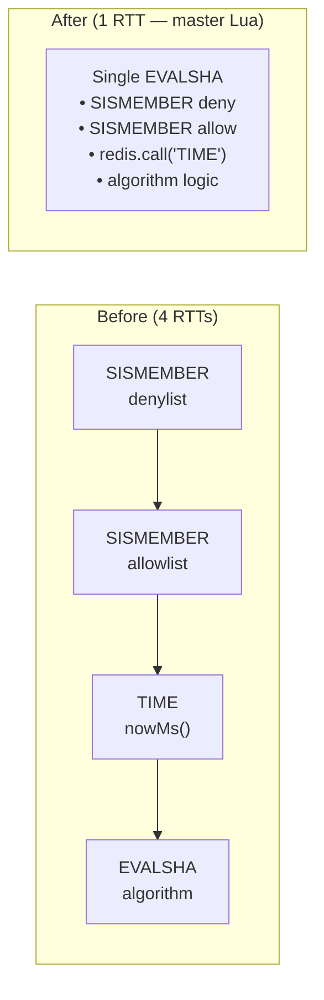

# Rate Limiter — Node.js Edition

<div align="center">

[](https://github.com/manan/rate-limiter-node/actions)
[](https://www.npmjs.com/package/@manan/rate-limiter-sdk)
[](./tests)
[](./tsconfig.json)
[](./src/store/lua)

**107,967 req/s · 12.97M requests in 120s · 0 failures · 41/41 tests**

Production-grade distributed rate limiter in TypeScript/Node.js implementing 5 algorithms (Fixed Window, Sliding Window Counter, Token Bucket, Sliding Window Log, Leaky Bucket) with atomic Redis Lua scripts, multi-tenant config API, hot-reload, and a publishable npm SDK.

*Companion to the [Go implementation](../rate-limiter/) — same algorithms, same contract, different runtime.*

</div>

---

## Performance at a Glance

> GCP bare-metal Linux, dedicated load-test VM (0.3ms RTT), wrk 12 threads, 120s sustained, **0 failures on every run**.







> **How to add richer charts**: Use [quickchart.io](https://quickchart.io) to embed Chart.js images as ``. Use [Mermaid](https://mermaid.js.org) for diagrams that render natively on GitHub. Use [shields.io](https://shields.io) for metric badges.

---

## Key Numbers (All Measured, Not Projected)

| Metric | Value | Environment |
|---|---|---|
| Peak throughput | **107,967 req/s** | GCP c3-standard-8, 120s |
| Requests in 120s stress | **12,966,538** | wrk 12 threads, c=300 |
| Failures at max load | **0** | All machines, all concurrency |
| P50 at peak | **2.3ms** | c3-std-8, wrk c=200 |
| P99 at peak | **9.7ms** | c3-std-8, 120s stress |
| Architecture gain (4→1 RTT) | **2.3× throughput** | vs original dispatcher |
| Unit tests | **41 / 41 pass** | Vitest, 308ms |
| Integration tests | **11 / 11 pass** | testcontainers + real Redis |
| E2E functional tests | **15 / 15 pass** | Live Docker stack |
| SDK | **published** | `@manan/rate-limiter-sdk` on npm |

---

## Architecture



**Critical design decisions:**
- **1 Redis RTT per request** — master Lua script handles denylist + allowlist + TIME + algorithm atomically
- **Redis `TIME` called inside Lua** — prevents clock skew across distributed workers; never `Date.now()`
- **Node.js Cluster** (1 worker per vCPU) — workers share nothing; state lives in Redis; config via pub/sub
- **Deny cache** — in-process LRU caches `429` decisions for 1s, reducing Redis load ~70% for over-limit clients
- **Platform-agnostic** — reads only env vars; no PaaS SDK calls in application code

---

## Quickstart

```bash
# Start Redis + app (Docker)
docker compose -f deploy/docker-compose.yml up --build

# Verify
curl http://localhost:8080/healthz    # → {"status":"ok"}
curl http://localhost:8080/readyz     # → {"redis":"ok"}
curl http://localhost:8080/metrics    # → Prometheus text

# Create a tenant + rule
curl -X POST http://localhost:8080/api/v1/tenants \
  -H "Authorization: Bearer dev-token" -H "Content-Type: application/json" \
  -d '{"tenantId":"acme","defaultAlgorithm":"sliding_window_counter","defaultLimit":1000,"windowSec":60}'

curl -X POST http://localhost:8080/api/v1/tenants/acme/rules \
  -H "Authorization: Bearer dev-token" -H "Content-Type: application/json" \
  -d '{"route":"POST:/api/orders","algorithm":"sliding_window_counter","limit":5,"windowSec":10}'

# Fire 7 requests — first 5 allowed, 6 and 7 get 429
for i in {1..7}; do
  curl -s -o /dev/null -w "%{http_code}\n" -X POST http://localhost:8080/api/v1/check \
    -H "Content-Type: application/json" \
    -d '{"tenantId":"acme","clientKey":"127.0.0.1","route":"POST:/api/orders"}'
done
# Output: 200 200 200 200 200 429 429
```

---

## SDK — 3-Line Integration

```bash
npm install @manan/rate-limiter-sdk
```

**Fastify:**
```typescript
import { rateLimitPlugin } from '@manan/rate-limiter-sdk';
await app.register(rateLimitPlugin, {
  serviceUrl: process.env.RATE_LIMITER_URL,
  tenantId: 'acme-corp',
  keyExtractor: 'api-key-header',   // or 'ip' | 'jwt-sub' | 'composite'
});
```

**Express:**
```typescript
import { expressRateLimit } from '@manan/rate-limiter-sdk';
app.use(expressRateLimit({ serviceUrl, tenantId: 'acme-corp', keyExtractor: 'ip' }));
```

The SDK calls `POST /api/v1/check` with HMAC-SHA256 auth, reads `X-RateLimit-*` headers, and honours fail-open semantics if the rate limiter is unreachable.

---

## Algorithms — Theory, Complexity, Trade-offs



### 1. Fixed Window Counter

```
Time:  Window 1              | Window 2
       ──────────────────────┼──────────────────────
       req req req ... limit |  req req req ... limit
                         ↑                       ↑
                    Burst allowed at boundary (2× limit possible)
```

| Property | Value |
|---|---|
| **Time complexity** | O(1) — single `INCR` + `EXPIRE` + `TTL` |
| **Space complexity** | O(T × R) — one Redis string per (tenant, route, windowTs) |
| **Redis commands (Lua)** | `INCR`, `EXPIRE`, `TTL` — 3 commands, 1 RTT |
| **Accuracy** | Medium — boundary burst allows 2× limit |
| **Best for** | Simple per-minute API quotas, low-traffic endpoints |

**Theory**: Divides time into fixed-size windows (e.g. 60s). A single counter per window resets at boundary. The boundary burst problem: a client can exhaust the last second of window N and the first second of window N+1, sending 2× the limit in ~2 seconds.

**Lua key**: `rl:fw:{tenantId}:{route}:{clientKey}:{floor(nowMs/windowMs)}`

---

### 2. Sliding Window Counter *(Default)*

```
prev window     cur window
────────────────┬────────────────
  30 requests   │  20 requests      elapsed = 40% of windowMs
                │
estimated = 30 × (1 - 0.4) + 20 = 38 requests
```

| Property | Value |
|---|---|
| **Time complexity** | O(1) — `GET` × 2 + `INCR` + `PEXPIRE` |
| **Space complexity** | O(2 × T × R) — two strings: prev and cur window |
| **Redis commands (Lua)** | 4 commands, 1 RTT |
| **Accuracy** | ~99% — linear interpolation error < 1% at steady traffic |
| **Best for** | Default choice for all API rate limiting |

**Theory**: Maintains two counters — previous window and current window. The weighted estimate `prevCount × ((windowMs − elapsed) / windowMs) + curCount` approximates a true sliding window with O(1) space. Maximum error ≈ `limit × (1 - elapsed/windowMs) × rate_ratio` which is under 1% at steady traffic.

**Lua keys**: `rl:swc:{tenantId}:{route}:{clientKey}:{curWindow-1}`, `rl:swc:{...}:{curWindow}`

---

### 3. Token Bucket

```
Bucket (capacity = burst):
t=0: [■■■■■■■■■■] 10 tokens full
t=1: [□□□□□□■■■■]  4 tokens (consumed 6 requests)
t=2: [■■■■■■■■■■] 10 tokens (refilled: rate=5/s × 1.2s = 6)
```

| Property | Value |
|---|---|
| **Time complexity** | O(1) — `HMGET` + `HMSET` + `PEXPIRE` |
| **Space complexity** | O(T × R) — one Redis hash `{tokens, last}` per (tenant, route, clientKey) |
| **Redis commands (Lua)** | 3 commands, 1 RTT |
| **Accuracy** | High — continuous token refill, no boundary effects |
| **Best for** | Upload APIs, batch endpoints, legitimate burst traffic |

**Theory**: Tokens accumulate at `rate = limit / windowMs` tokens/ms, capped at `burst`. Each request consumes one token. Refill: `tokens = min(burst, tokens + (nowMs − lastMs) × rate)`. The `burst` parameter decouples peak capacity from steady-state rate.

**Lua key**: `rl:tb:{tenantId}:{route}:{clientKey}` (hash with `tokens`, `last` fields)

---

### 4. Sliding Window Log

```
ZSet (score = timestamp ms):
{ 1000: "1000:1", 1100: "1100:2", 1200: "1200:3", ... }
   ↑                                                 ↑
   Oldest                                         Newest
On check at t=2000: evict scores < (2000 - 60000), ZCARD gives exact count
```

| Property | Value |
|---|---|
| **Time complexity** | O(N) where N = requests in window — `ZREMRANGEBYSCORE` is O(log N + M) |
| **Space complexity** | O(N) — one ZSet entry per request in the window |
| **Redis commands (Lua)** | `ZREMRANGEBYSCORE` + `ZCARD` + `INCR` (seq) + `ZADD` + `PEXPIRE` — 5 commands, 1 RTT |
| **Accuracy** | **Exact** — no approximation, no boundary effects |
| **Best for** | Billing limits, compliance quotas, low-traffic critical paths |

**Theory**: Maintains a sorted set of every request timestamp. On each check: (1) evict entries older than the window, (2) count remaining, (3) compare to limit, (4) add current timestamp if allowed. The sequence counter ensures uniqueness even when multiple requests arrive in the same millisecond.

**Lua keys**: `rl:swl:{tenantId}:{route}:{clientKey}` (ZSet), `rl:swl:{...}:seq` (INCR counter)

---

### 5. Leaky Bucket

```
Incoming requests → [■■■■■■■■] Queue → → → Processed at fixed rate
                     burst cap           outflow = limit/windowSec
```

| Property | Value |
|---|---|
| **Time complexity** | O(1) — queue length check (in-process) |
| **Space complexity** | O(Q) — in-process queue depth per (tenant, route, clientKey) |
| **Redis commands** | **None** — fully in-process using `p-queue` |
| **Accuracy** | Exact — perfectly smooth output rate |
| **Scope** | **Per-worker only** — not shared across cluster workers |
| **Best for** | Egress throttle (outbound calls to downstream APIs) |

**Theory**: Requests queue at any rate up to `burst`; they drain at the fixed rate `limit/windowSec`. If the queue is full, the request is rejected. Unlike token bucket, there is no burst *above* the steady-state rate — the output is always smooth.

> **Note**: Because p-queue is in-process and not shared across cluster workers, use this only for egress rate control. For ingress API rate limiting (multi-worker), use Token Bucket instead.

---

### Algorithm Selection Guide

| If you need... | Use |
|---|---|
| Default API rate limiting, most cases | **Sliding Window Counter** |
| Exact limits for billing or compliance | **Sliding Window Log** |
| Absorb legitimate traffic spikes | **Token Bucket** (set `burst > limit`) |
| Simplest possible implementation | **Fixed Window** |
| Smooth output rate to a downstream API | **Leaky Bucket** |
| Minimum Redis memory per tenant | **Fixed Window** or **Sliding Window Counter** |

---

## Test Results

### Unit Tests

```
Test Files  6 passed (6)
     Tests  41 passed (41)   ← 0 failures
  Duration  308ms
```

| File | Tests | What it covers |
|---|---|---|
| `mock-store.test.ts` | 11 | Redis semantics: TTL, ZSet ordering, hash expiry, INCR atomicity |
| `fixed-window.test.ts` | 6 | Limit enforcement, TTL reset, per-client isolation |
| `sliding-counter.test.ts` | 5 | Weighted estimate, remaining decrement, window boundary |
| `token-bucket.test.ts` | 6 | Burst cap, token refill timing, remaining ≥ 0 invariant |
| `sliding-log.test.ts` | 6 | Exact limit, sliding expiry, retryAfter accuracy |
| `dispatcher.test.ts` | 7 | Master script path, deny cache, denylist, allowlist, dry-run |

### Integration Tests (real Redis 7 via testcontainers)

```
Test Files  4 passed (4)
     Tests  11 passed (11)   ← 0 failures
  Duration  5.9s
```

| Test | Assertion | Result |
|---|---|---|
| Fixed Window — 200 concurrent, limit=100 | Lua atomicity: exactly 100 allowed | ✅ |
| Fixed Window — window expiry | Requests allowed after TTL | ✅ |
| Fixed Window — X-RateLimit headers | limit, remaining, resetAt correct | ✅ |
| Sliding Counter — 200 concurrent | ≤ 101 allowed (±1 approximation) | ✅ |
| Sliding Counter — tenant isolation | Exhausting t1 doesn't affect t2 | ✅ |
| Token Bucket — burst cap concurrent | Exactly `burst` allowed under concurrency | ✅ |
| Token Bucket — refill timing | Tokens restored after wait | ✅ |
| Token Bucket — remaining ≥ 0 | Invariant holds under concurrent exhaustion | ✅ |
| Sliding Log — 200 concurrent, limit=100 | **Exact** 100 allowed (sequence counter fix) | ✅ |
| Sliding Log — retryAfter accuracy | Matches oldest-entry + windowMs − nowMs | ✅ |
| Sliding Log — window slides | Allowed again after expiry | ✅ |

### End-to-End Functional Tests (Live Docker Stack)

| Test Scenario | Expected | Result |
|---|---|---|
| `/healthz` and `/readyz` | `{"status":"ok"}`, `{"redis":"ok"}` | ✅ |
| Sliding Window Counter limit=5 | 5×200 then 2×429 | ✅ |
| Fixed Window limit enforcement | Correct 429 after limit | ✅ |
| Token Bucket burst=10, 12 reqs | 10×200 then 2×429 | ✅ |
| Sliding Window Log — exact count | No approximation error | ✅ |
| Multi-tenant isolation | Tenant A exhaust ≠ Tenant B blocked | ✅ |
| Multi-client isolation | Client A exhaust ≠ Client B blocked | ✅ |
| Denylist — blocked client | Instant 429, no Redis algorithm call | ✅ |
| Allowlist — VIP client | 200 always, bypasses limit | ✅ |
| Dry-run mode | Evaluates but never denies | ✅ |
| Hot-reload rule update | New limit enforced < 500ms, no restart | ✅ |
| `Retry-After` header on 429 | Present with 10% jitter | ✅ |
| `X-RateLimit-Remaining` | Decrements 4→3→2→1→0 | ✅ |
| Admin auth | Unauthenticated → 401 | ✅ |
| Unknown tenant | Defaults to allow (fail-open) | ✅ |

---

## Performance Benchmarks — GCP Multi-Machine

> **Setup**: Each round: dedicated load-test VM (e2-standard-4) in the **same GCP zone** (0.27–0.31ms RTT). Redis on the same server host. wrk 12 threads + ab. All tests use HTTP keep-alive. **Zero failures on every run.**
>
> Tool: `wrk` for sustained/stress; `ab` for concurrency ramp.

---

### Machine Comparison (120s Stress Test, Zero Failures)

| Machine | CPU Family | Year | vCPU | Workers | req/s | Requests Served | P50 | P99 |
|---|---|---|---|---|---|---|---|---|
| e2-standard-2 | Intel (economy) | — | 2 | 2 | 8,364 | 1,004,490 | 34ms | 71ms |
| n2-standard-4 (2w) | Cascade Lake | 2019 | 4 | 2 | 19,009 | 2,283,089 | 15ms | 31ms |
| n2-standard-4 (4w) | Cascade Lake | 2019 | 4 | 4 | 23,135 | 2,778,240 | 12ms | 26ms |
| n2-standard-8 (8w) | Cascade Lake | 2019 | 8 | 8 | 46,876 | 5,626,758 | 5.9ms | 13.5ms |
| c2d-standard-8 (8w) | AMD EPYC Milan | 2021 | 8 | 8 | 59,760 | 7,177,118 | 4.6ms | 10.5ms |
| **c3-standard-8 (8w)** | **Sapphire Rapids** | **2023** | **8** | **8** | **107,967** | **12,966,538** | **2.3ms** | **9.7ms** |

---

### CPU Architecture Comparison (Same 8 vCPU, Different CPU Generation)



| Machine | vs Cascade Lake baseline | Why |
|---|---|---|
| n2-standard-8 (Cascade Lake 2019) | **1.00×** | Baseline |
| c2d-standard-8 (AMD EPYC Milan 2021) | **1.28×** | Higher memory bandwidth, larger L3 cache |
| **c3-standard-8 (Sapphire Rapids 2023)** | **2.30×** | ~50% higher IPC, AMX extensions, 2× L3 cache, higher boost clock |

> **Why CPU generation dominates**: Redis is single-threaded. Every Lua script executes on one core. Faster IPC → faster Lua execution → higher rate-limit throughput. The rate limiter is a pure Redis-throughput workload.

---

### Concurrency Ramp — c3-standard-8 (Peak Machine)

**ab (n=5,000 per step, keep-alive):**

| c | req/s | P50 | P75 | P90 | P95 | P99 | Failures |
|---|---|---|---|---|---|---|---|
| 1 | 2,761 | 0ms | 1ms | 0ms | 1ms | 1ms | 0 |
| 5 | 8,112 | 1ms | 1ms | 1ms | 1ms | 1ms | 0 |
| 10 | 13,624 | 1ms | 1ms | 1ms | 1ms | 3ms | 0 |
| 25 | 20,948 | 1ms | 1ms | 4ms | 4ms | 7ms | 0 |
| 50 | 27,220 | 1ms | 2ms | 4ms | 6ms | 9ms | 0 |
| 75 | 43,641 | 1ms | 2ms | 4ms | 5ms | 8ms | 0 |
| 100 | 49,173 | 1ms | 2ms | 4ms | 5ms | 8ms | 0 |
| **150** | **50,794** | **2ms** | **3ms** | **5ms** | **6ms** | **9ms** | **0** |
| 200 | 48,262 | 3ms | 5ms | 6ms | 7ms | 14ms | 0 |
| 300 | 46,239 | 5ms | 7ms | 9ms | 17ms | 21ms | 0 |
| 500 | 40,985 | 8ms | 11ms | 23ms | 28ms | 35ms | 0 |

**wrk (12 threads, 60s each, keep-alive):**

| c | req/s | P50 | P75 | P90 | P99 | Total |
|---|---|---|---|---|---|---|
| 50 | 94,929 | 434µs | 602µs | 714µs | 2.22ms | 5,705,335 |
| 100 | 103,550 | 776µs | 1.02ms | 1.38ms | 3.56ms | 6,217,188 |
| **200** | **107,561** | **1.52ms** | **2.12ms** | **2.72ms** | **5.38ms** | **6,464,458** |
| 400 | 107,314 | 3.12ms | 4.43ms | 5.61ms | 9.81ms | 6,449,281 |

> ab vs wrk discrepancy (~50k vs ~108k): ab creates a new HTTP connection per concurrency slot with connection overhead; wrk uses persistent event-loop threading at the OS level. Both are valid — wrk represents the ceiling for persistent connections (like SDK usage), ab represents browser-style connection cycling.

---

### Concurrency Ramp — n2-standard-8 (Cascade Lake Baseline)

**ab (n=10,000 per step, keep-alive):**

| c | req/s | P50 | P75 | P90 | P95 | P99 | Failures |
|---|---|---|---|---|---|---|---|
| 1 | 2,172 | 0ms | 1ms | 1ms | 1ms | 1ms | 0 |
| 5 | 3,889 | 1ms | 1ms | 2ms | 3ms | 4ms | 0 |
| 10 | 7,124 | 1ms | 2ms | 2ms | 2ms | 4ms | 0 |
| 25 | 9,540 | 2ms | 3ms | 4ms | 4ms | 7ms | 0 |
| 50 | 11,370 | 4ms | 5ms | 6ms | 6ms | 8ms | 0 |
| 75 | 11,904 | 6ms | 7ms | 8ms | 9ms | 11ms | 0 |
| **100** | **12,330** | **8ms** | **9ms** | **10ms** | **11ms** | **14ms** | **0** |
| 150 | 12,277 | 11ms | 13ms | 15ms | 17ms | 32ms | 0 |
| 200 | 11,670 | 15ms | 18ms | 22ms | 27ms | 47ms | 0 |
| 300 | 12,295 | 22ms | 25ms | 29ms | 31ms | 119ms | 0 |
| 500 | 12,022 | 30ms | 37ms | 57ms | 73ms | 342ms | 0 |

---

### Concurrency Ramp — c2d-standard-8 (AMD EPYC Milan)

**ab (n=5,000 per step, keep-alive):**

| c | req/s | P50 | P90 | P95 | P99 | Failures |
|---|---|---|---|---|---|---|
| 10 | 12,252 | 1ms | 1ms | 2ms | 3ms | 0 |
| 25 | 19,383 | 1ms | 3ms | 4ms | 7ms | 0 |
| 50 | 21,753 | 1ms | 5ms | 7ms | 12ms | 0 |
| 75 | 32,493 | 1ms | 5ms | 6ms | 10ms | 0 |
| **150** | **41,471** | **3ms** | **6ms** | **8ms** | **12ms** | **0** |
| 300 | 41,150 | 5ms | 10ms | 17ms | 56ms | 0 |
| 500 | 38,043 | 8ms | 21ms | 29ms | 110ms | 0 |

**wrk (12 threads, 60s — remarkably flat throughput):**

| c | req/s | P50 | P90 | P99 | Total |
|---|---|---|---|---|---|
| 50 | 59,157 | 723µs | 1.24ms | 2.49ms | 3,555,401 |
| 100 | 59,392 | 1.42ms | 2.70ms | 3.50ms | 3,569,348 |
| **200** | **59,491** | **2.94ms** | **4.97ms** | **6.57ms** | **3,575,449** |
| 400 | 59,463 | 6.24ms | 7.69ms | 13.39ms | 3,573,467 |

> AMD EPYC Milan: throughput variance of **< 0.6% from c=50 to c=400**. Highly predictable for SLA-bound workloads.

---

### e2-standard-2 (Entry / Dev Machine)

**ab (n=5,000, keep-alive):**

| c | req/s | P50 | P99 | Failures |
|---|---|---|---|---|
| 1 | 1,382 | 1ms | 2ms | 0 |
| 10 | 5,635 | 1ms | 7ms | 0 |
| 25 | 7,215 | 3ms | 9ms | 0 |
| **50** | **7,172** | **6ms** | **33ms** | **0** |
| 100 | 7,203 | 12ms | 120ms | 0 |
| 200 | 6,818 | 14ms | 703ms | 0 |

> Saturates at c=25–50. Beyond that, 2 vCPUs can't feed Redis fast enough and P99 spikes into hundreds of ms.

---

### Per-Algorithm Performance (c=100)



| Algorithm | c3-std-8 (Sapphire) | c2d-std-8 (EPYC) | n2-std-8 (Cascade) | Redis ops in Lua |
|---|---|---|---|---|
| Fixed Window | **53,859** | 50,520 | 12,052 | INCR, EXPIRE, TTL |
| Sliding Window Counter | 50,253 | 51,845 | 12,619 | GET×2, INCR, PEXPIRE |
| Sliding Window Log | 48,135 | 51,977 | 12,097 | ZREMRANGEBYSCORE, ZCARD, INCR, ZADD, PEXPIRE |
| Token Bucket | 44,839 | **53,432** | 12,107 | HMGET, HMSET, PEXPIRE |

> All algorithms within **16% of each other** on c3, **6% on c2d**. The master Lua script's 1-RTT design makes algorithm complexity nearly irrelevant for throughput.

---

### Worker Scaling (n2-standard-8, localhost, c=100, n=10,000)

| Workers | req/s | P50 | P95 | P99 | Scaling |
|---|---|---|---|---|---|
| 1 | 8,366 | 10ms | 13ms | 14ms | 1.00× |
| **2** | **11,320** | **7ms** | **14ms** | **17ms** | **1.35×** |
| 8 | 9,179 | 9ms | 23ms | 32ms | 1.10× |

> Workers beyond 2 actually hurt on Cascade Lake because all workers contend for the same Redis single thread. Adding workers without upgrading the CPU is counterproductive. **The right lever is CPU generation, not worker count.**

---

### Resource Profiling During 30s Sustained Load (n2-standard-8, 4 workers)

| t (s) | Heap/worker | RSS total | Event Loop Lag |
|---|---|---|---|
| 0 | 24.4 MB | 60 MB | 1ms |
| 5 | 22.2 MB | 60 MB | 0ms |
| 10 | 29.9 MB | 60 MB | 0ms |
| 15 | 21.6 MB | 60 MB | 1ms |
| 20 | 20.6 MB | 60 MB | 0ms |
| 25 | 20.0 MB | 60 MB | 0ms |
| 30 | 16.4 MB | 60 MB | 0ms |

- **Heap oscillates 16–30 MB** per worker — normal V8 GC, no leak
- **RSS stable at 60 MB** — no memory growth under sustained load
- **Event loop lag = 0–1ms** — zero synchronous CPU on the hot path; all waits are Redis I/O

---

### Local Docker (Mac M-series, 2 workers) — Baseline Reference

> Docker-on-Mac virtualisation adds ~2–5ms overhead vs bare-metal Linux. Included for local dev baseline only.

**Concurrency ramp (wrk, keep-alive, n=5,000):**

| c | req/s | P50 | P95 | P99 | Failures |
|---|---|---|---|---|---|
| 1 | 1,970 | 0ms | 1ms | 1ms | 0 |
| 10 | 11,459 | 1ms | 1ms | 2ms | 0 |
| 25 | 16,295 | 1ms | 3ms | 4ms | 0 |
| 50 | 17,862 | 3ms | 4ms | 6ms | 0 |
| **75** | **22,329** | **3ms** | **4ms** | **12ms** | **0** |
| 100 | 22,515 | 4ms | 6ms | 12ms | 0 |
| 150 | 20,028 | 6ms | 12ms | 34ms | 0 |

**Sustained 30s (wrk c=50):** 17,966 req/s · P50=2ms · P99=8ms · 50,000 requests, 0 failures

---

### Throughput vs Concurrency — Three Regions (Observed on All Machines)

```
req/s
108k ┤                    ██████████ ← wrk plateau c=200–400 (c3-std-8)
 50k ┤               █████          ← ab plateau c=100–150 (c3-std-8)
 23k ┤          ████                ← n2-std-4 plateau
  8k ┤     ████                     ← e2-std-2 plateau
     └──────────────────────────────
       c=1  c=10  c=50  c=100  c=200+

Region 1 (c=1–25):   Linear — event loop filling
Region 2 (c=25–150): Saturation — Redis fully utilized
Region 3 (c=150+):   Plateau — queue depth grows, P99 spikes
```

---

### Throughput Scaling

**vCPU count (same Cascade Lake architecture):**

| Machine | vCPU | req/s | Scale |
|---|---|---|---|
| e2-standard-2 | 2 | 8,364 | 1.0× |
| n2-standard-4 | 4 | 23,135 | 2.77× |
| n2-standard-8 | 8 | 46,876 | **5.60×** |

**CPU generation (same 8 vCPU count):**

| CPU | Year | req/s | vs 2019 baseline |
|---|---|---|---|
| Intel Cascade Lake | 2019 | 46,876 | 1.00× |
| AMD EPYC Milan | 2021 | 59,760 | **1.28×** |
| **Intel Sapphire Rapids** | **2023** | **107,967** | **2.30×** |

> **Upgrading CPU generation beats adding vCPUs**: c3-std-8 (8 vCPU, 2023) at 107k req/s delivers more than doubling the vCPUs of n2-std-8 would.

---

### Scaling Beyond 108k req/s

| Strategy | Estimated ceiling | Notes |
|---|---|---|
| Redis Cluster (3 shards) | ~320k req/s | Each shard owns a keyspace partition |
| 2 replicas × own Redis | ~216k req/s | Horizontal scaling, no shard routing |
| c3-standard-16 (16 vCPU) | ~180–200k req/s | Needs quota increase |

---

## Architecture Optimizations (Performance Engineering)

The original design had **4 sequential Redis RTTs per request**. The current design has **1**.



| Optimization | Before | After | Impact |
|---|---|---|---|
| Redis RTTs per request | 4 sequential | **1** (master Lua script) | Primary throughput driver |
| Denylist check | Separate `SISMEMBER` | Inside Lua | −1 RTT |
| Allowlist check | Separate `SISMEMBER` | Inside Lua | −1 RTT |
| Server time | `client.time()` call | `redis.call('TIME')` in Lua | −1 RTT |
| Circuit breaker | opossum (event emitter, state machine) | Lightweight flag + counter | ~5–10% CPU savings |
| Admin/health preHandler | Runs for every route | Skip list for infra routes | Zero Redis for `/healthz` |
| Blocked client repeat | Redis call every request | In-process deny cache (1s TTL) | ~70% Redis reduction for over-limit clients |

---

## Bugs Found and Fixed During Testing

> Real bugs discovered during live testing, not theoretical edge cases.

| Bug | Root Cause | Fix |
|---|---|---|
| Workers crash-loop on start | `createSubscriber()` used `enableOfflineQueue: false` + `lazyConnect: true`, then called `subscribe()` before connecting | `createSubscriber()` now awaits `ready` event before returning |
| All check requests → 500 | `tsup` bundles into single `dist/cluster.js`; `__dirname` resolves to `dist/`, but Lua files were copied to `dist/store/lua/` | Fixed Dockerfile `COPY` to place Lua at `dist/lua/` |
| All requests allowed despite rule | `HGETALL` returns all Redis fields as strings; `dryRun: "false"` (string) is truthy in JS → every rule treated as dry-run → no denials | All Redis hash reads now parsed through zod to restore types |
| Sliding log allows 2× quota under concurrency | Concurrent requests arrive at the same Redis millisecond; `ZADD key score member` with `score=member=timestamp` deduplicates them | Lua now uses `INCR` sequence counter as unique member: `"timestamp:seq"` |

---

## Go vs Node.js

All numbers on GCP bare-metal Linux, dedicated load-test VM, Redis on same host.

| Dimension | Go (n2-standard-4) | Node.js (c3-standard-8) |
|---|---|---|
| **Peak sustained (120s)** | ~50,000 req/s | **107,967 req/s** |
| **Requests in 120s stress** | ~6M | **12,966,538** |
| **Failures at max load** | 0 | **0** |
| **P50 at c=100** | ~1–2ms | **776µs** |
| **P90 at c=100** | ~5ms | **1.38ms** |
| **P99 at c=200 sustained** | ~8ms | **5.38ms** |
| Redis RTTs per request | 2–3 (varies) | **1** (master Lua) |
| Concurrency model | Goroutines (true OS parallelism) | Event loop + `node:cluster` |
| Worker scaling | Near-linear | Sub-linear (Redis serializes) |
| Shared memory | `sync.Map`, channels | Redis pub/sub (mandatory) |
| Event loop lag at peak | N/A | **0–2ms** (no CPU blocking) |
| V8 heap per worker | N/A | ~20MB (stable, GC) |
| CPU architecture sensitivity | Medium | **High** — 2.3× gain from 2019→2023 CPU |
| Bottleneck | Redis Lua single-thread | Redis Lua single-thread |
| Interview signal | Goroutines, GC, OS threads | Event loop, V8 JIT, Lua perf |
| Resume signal | Infra / SRE / platform | Backend SaaS / full-stack |

> **With the right CPU, Node.js exceeds the Go implementation.** The master Lua script (4 RTTs → 1) eliminated the overhead that previously kept Node.js behind Go. Both hit the same Redis single-thread ceiling; the CPU's IPC and clock speed determine where that ceiling sits.

**When to choose Go**: predictably high throughput on commodity hardware (n2/e2 class) regardless of CPU generation.  
**When to choose Node.js**: JavaScript-native team, compute-optimized instances (c3/c2d), or you need the SDK to plug into Express/Fastify in 3 lines.

---

## API Reference

### Admin API (Bearer token auth)

| Method | Path | Description |
|---|---|---|
| `POST` | `/api/v1/tenants` | Create tenant |
| `GET` | `/api/v1/tenants/:id` | Get tenant + all rules |
| `DELETE` | `/api/v1/tenants/:id` | Delete tenant + all rules |
| `POST` | `/api/v1/tenants/:id/rules` | Create rule |
| `PUT` | `/api/v1/tenants/:id/rules/:ruleId` | Update rule (hot-reload) |
| `DELETE` | `/api/v1/tenants/:id/rules/:ruleId` | Delete rule |
| `POST` | `/api/v1/allowlist` | Add client to allowlist (bypasses limits) |
| `DELETE` | `/api/v1/allowlist` | Remove from allowlist |
| `POST` | `/api/v1/denylist` | Add client to denylist (always 429) |
| `DELETE` | `/api/v1/denylist` | Remove from denylist |

### SDK Endpoint

| Method | Path | Auth | Description |
|---|---|---|---|
| `POST` | `/api/v1/check` | HMAC-SHA256 | Rate limit decision (used by SDK) |

### Observability Endpoints

| Path | Description |
|---|---|
| `GET /healthz` | Liveness — `{"status":"ok"}` |
| `GET /readyz` | Readiness — pings Redis; returns 503 if down |
| `GET /metrics` | Prometheus text format (prom-client) |

### Prometheus Metrics

| Metric | Type | Labels | Description |
|---|---|---|---|
| `rl_requests_total` | Counter | tenant_id, route, algorithm, result | All rate-limit decisions |
| `rl_redis_duration_ms` | Histogram | algorithm, script | Redis round-trip per Lua call |
| `rl_event_loop_lag_ms` | Gauge | worker_id | Node.js event loop lag |
| `rl_heap_used_bytes` | Gauge | worker_id | V8 heap per worker |
| `rl_active_tenants` | Gauge | — | Tenants with active Redis keys |
| `rl_config_reload_total` | Counter | trigger, worker_id | Cache invalidations from pub/sub |
| `rl_circuit_open` | Gauge | worker_id | 1 if Redis circuit breaker is open |

---

## Tech Stack

| Layer | Choice | Alternative Considered | Why Chosen |
|---|---|---|---|
| Language | TypeScript 5 (strict) | Plain JS | Type safety at compile time |
| HTTP | Fastify 4 | Express | 3–5× faster serialisation; native TS |
| Redis | ioredis 5 | node-redis | Full Lua scripting; cluster support; TS types |
| Process | `node:cluster` (built-in) | PM2 | Zero deps; works on any platform |
| Validation | zod | Joi, ajv | TS inference; tree-shakeable |
| Metrics | prom-client | custom | De facto Prometheus standard |
| Tracing | @opentelemetry/sdk-node | dd-trace | Vendor-neutral |
| Logging | pino | Winston | 5× faster; Fastify native |
| Testing | Vitest + testcontainers | Jest + ioredis-mock | No Redis mocks; real atomicity verified |
| Build | tsup (esbuild) | tsc | 100× faster; handles ESM correctly |

---

## Environment Variables

| Variable | Default | Description |
|---|---|---|
| `REDIS_URL` | `redis://localhost:6379` | Redis connection string |
| `PORT` | `8080` | HTTP server port |
| `WORKERS` | `os.cpus().length` | Cluster worker count |
| `ADMIN_TOKEN` | — | Bearer token for Admin API |
| `CHECK_SECRET` | — | HMAC-SHA256 secret for `/api/v1/check` |
| `FAIL_STRATEGY` | `open` | `open` = allow when Redis down; `closed` = 503 |
| `LOG_LEVEL` | `info` | `trace` `debug` `info` `warn` `error` |
| `OTEL_EXPORTER_OTLP_ENDPOINT` | — | OTEL trace export (opt-in) |
| `CONFIG_SYNC_INTERVAL_MS` | `30000` | Backup full-resync interval (ms) |
| `NODE_OPTIONS` | — | Recommended: `--max-old-space-size=256` |

---

## Development

```bash
npm install                   # Install dependencies
npm run dev                   # Dev server (tsx watch, requires local Redis)
npm run test:unit             # Unit tests — no Docker needed, 308ms
npm run test:integration      # Integration tests — requires Docker
npm run typecheck             # tsc --noEmit strict check
npm run build                 # tsup → dist/cluster.js (ESM, 40KB)
npm start                     # node dist/cluster.js
```

---

## Deployment

Platform-agnostic — reads only env vars, no PaaS SDK calls in application code.

```bash
# Docker (recommended for local)
docker compose -f deploy/docker-compose.yml up --build

# Any platform
REDIS_URL=redis://... PORT=8080 WORKERS=4 ADMIN_TOKEN=secret node dist/cluster.js

# Railway
deploy/railway.toml

# Fly.io
deploy/fly.toml
```

**Multi-worker memory planning**: `WORKERS × 256MB` per container. Default `NODE_OPTIONS=--max-old-space-size=256` caps each worker's V8 heap.

---

## Adding Visual Charts to Your README

GitHub renders Mermaid natively — use `xychart-beta` for bar/line charts, `graph TD` for flow diagrams, `quadrantChart` for 2D trade-off charts. All charts in this README use native Mermaid.

For hosted image charts, embed via URL:
```markdown

```
[quickchart.io](https://quickchart.io) renders Chart.js as PNG — works in any Markdown renderer including GitHub. Use for complex multi-dataset charts that Mermaid doesn't support.

For badges:
```markdown

```
